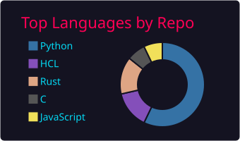
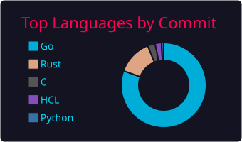
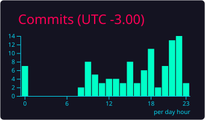

## Hi!

I’ve been passionate about programming and technology since I was a kid. I’ve always loved solving problems and building systems to make my daily tasks easier. Nowadays, I apply this same mindset to my professional experience, always aiming for quality and continuous process improvement, while prioritizing value and impact.

 
  

  

### ❤️ Let's get connected:

